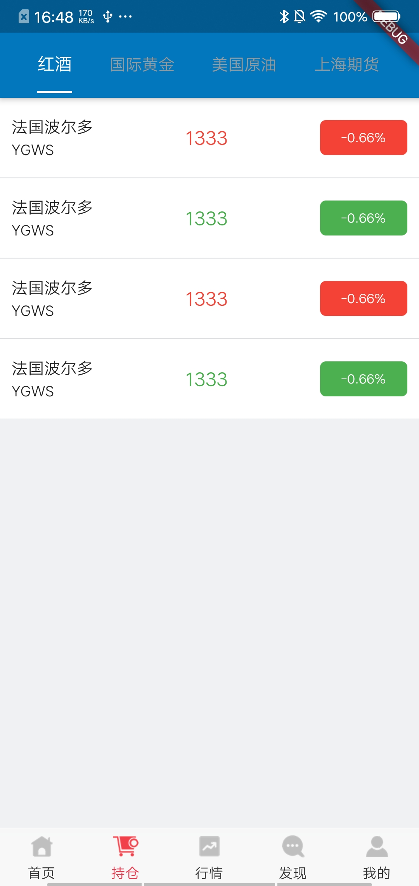
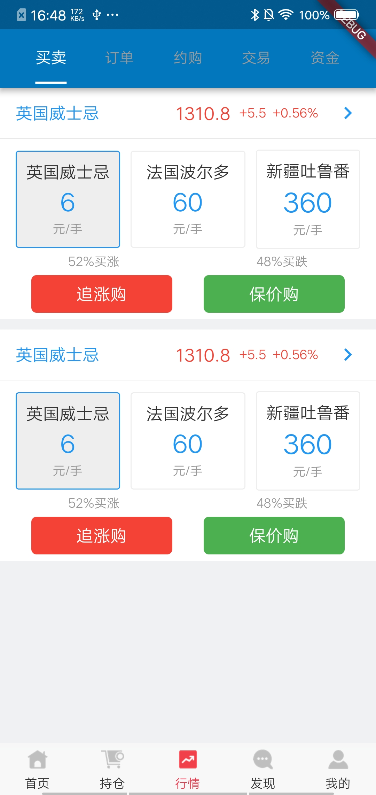
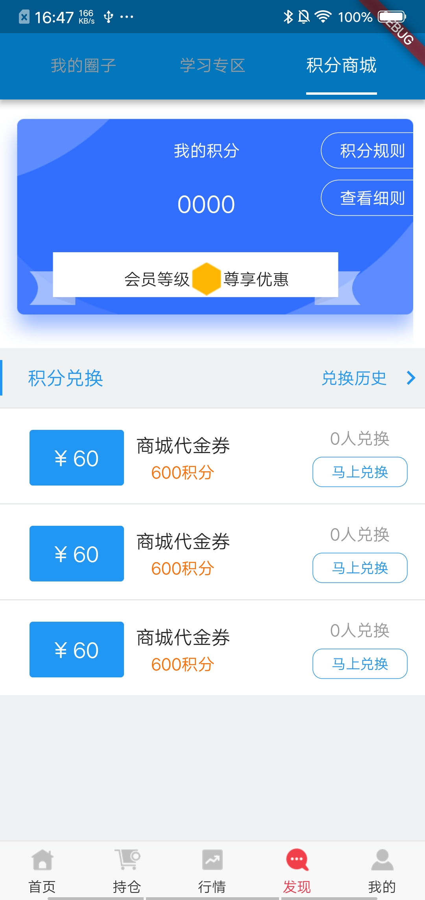
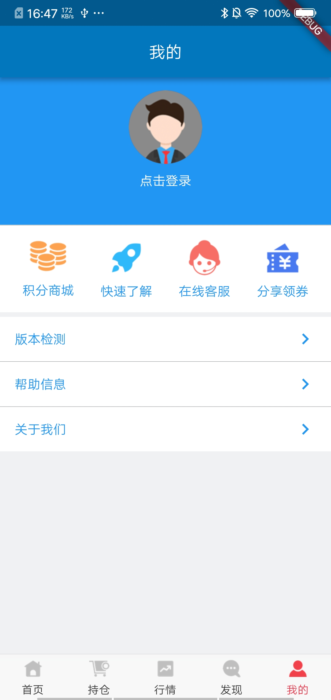
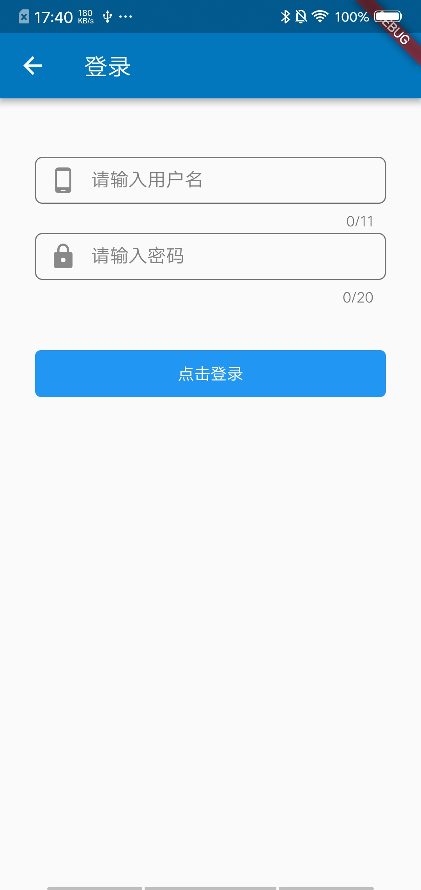

# FlutterTrain

这是Flutter个人练习项目

## 了解Flutter：
- [Flutter SDK](https://docs.flutter.io/index.html)
- [Flutter Doc 中文版](https://flutterchina.club/docs/)
- [Flutter Doc 英文版](https://flutter.io/docs)

## 功能

- [x] 登录（使用测试账号）
- [x] 首页
- [x] 个人中心
- [x] 持仓
- [x] 行情
- [x] 积分商城
- [x] 公共WebView
- [ ] 未完待续...

## 截图

    
    
    

    
    
    

## LICENSE
The MIT License (MIT)

Copyright (c) 2019 SNXJ
