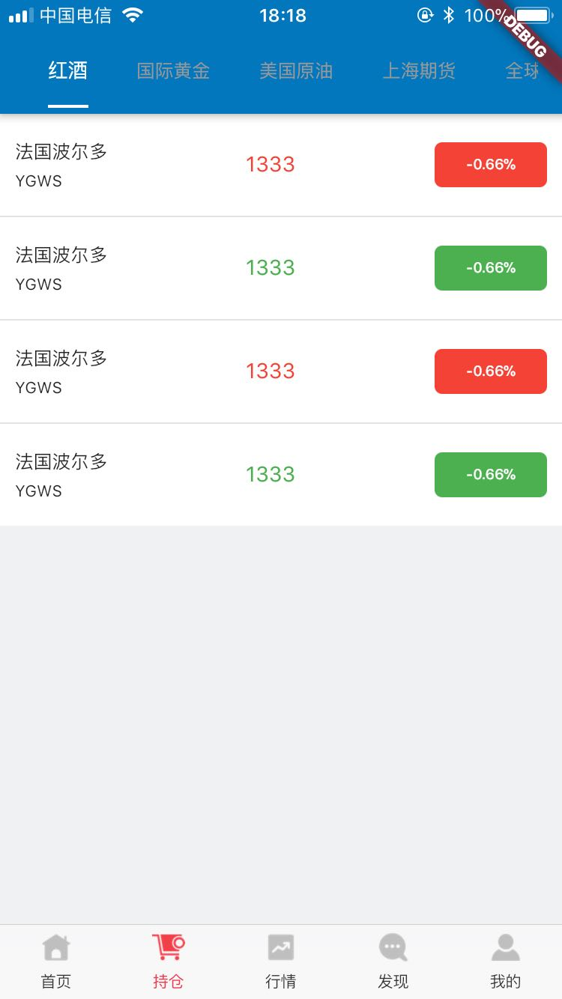
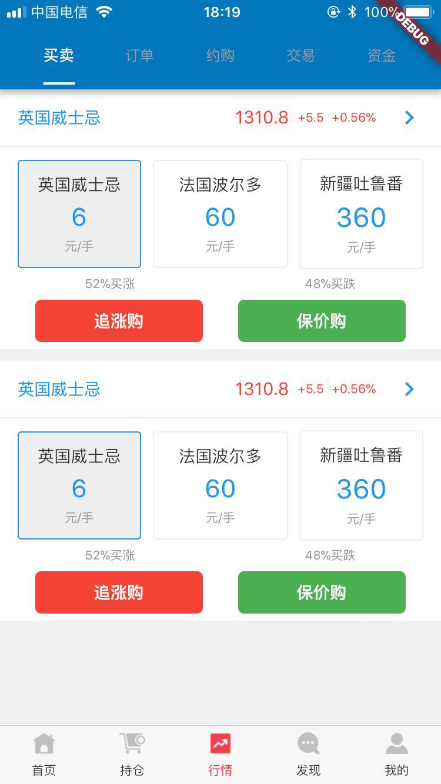
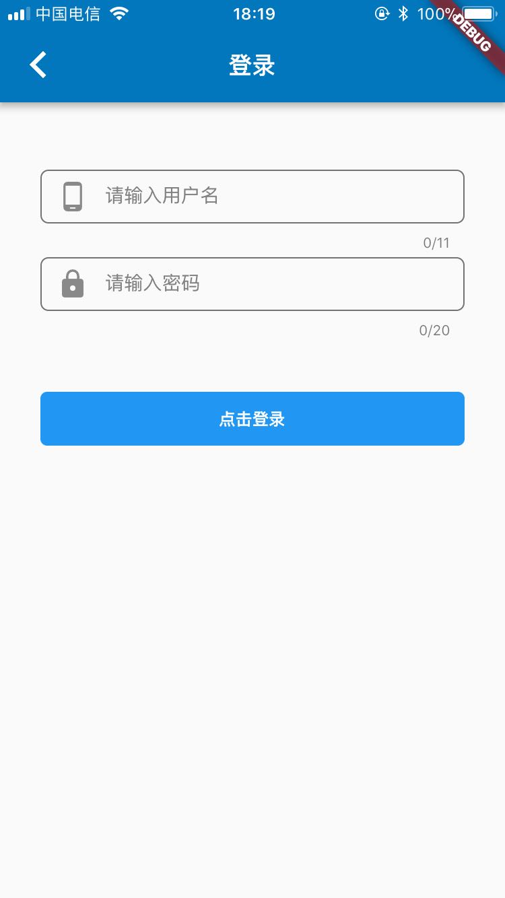

# FlutterTrain

这是Flutter个人练习项目

## 了解Flutter：
- [Flutter SDK](https://docs.flutter.io/index.html)
- [Flutter Doc 中文版](https://flutterchina.club/docs/)
- [Flutter Doc 英文版](https://flutter.io/docs)
- [Dart 中文版](https://www.kancloud.cn/marswill/dark2_document/709087)

## 功能

- [x] 登录（使用测试账号）
- [x] 首页
- [x] 个人中心
- [x] 持仓
- [x] 行情
- [x] 积分商城
- [x] 公共WebView
- [ ] 未完待续...

### bug 注意：

    flutter的stable v1.0.0 在IOS build时遇到以下bug
    
    ld: framework not found Flutter
    
    解决：更新flutter(切换到master或着beta)
    
    

## android截图

    
    
    

    
    
    

## IOS截图

    
    
    

    
    
    

## LICENSE
The MIT License (MIT)

Copyright (c) 2019 SNXJ
